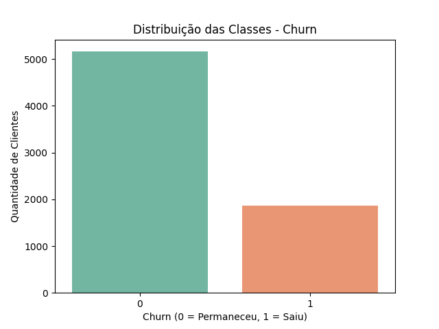
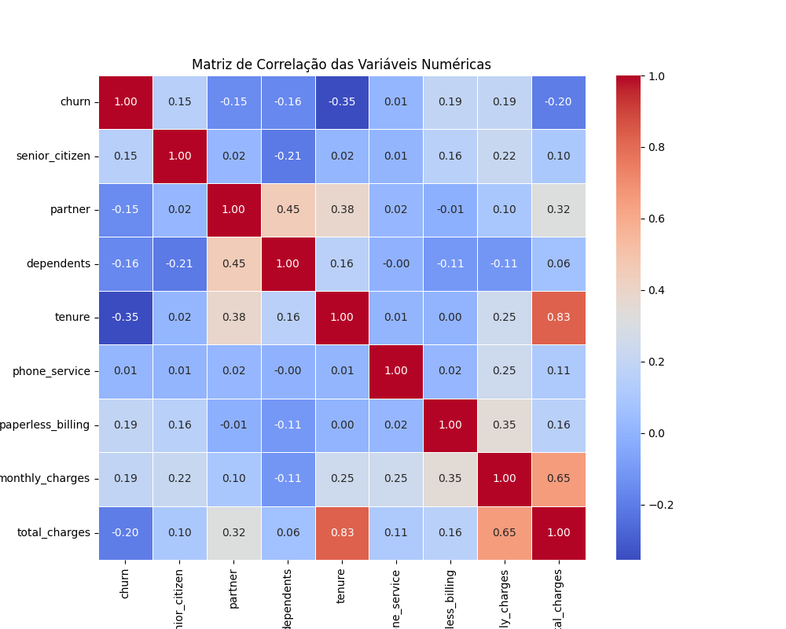
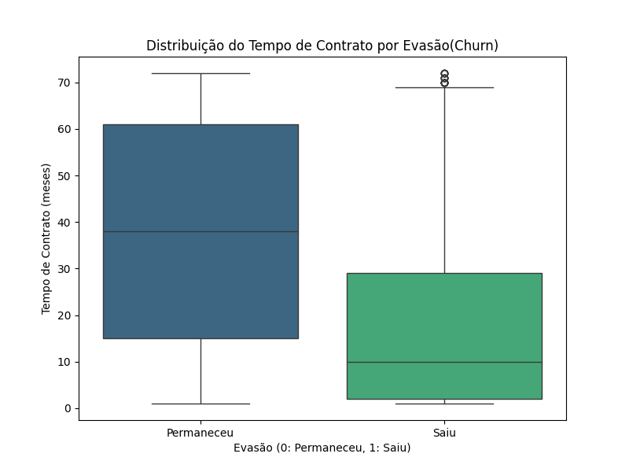
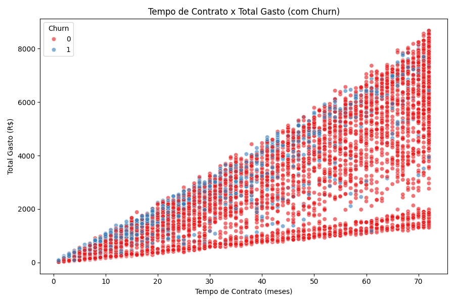
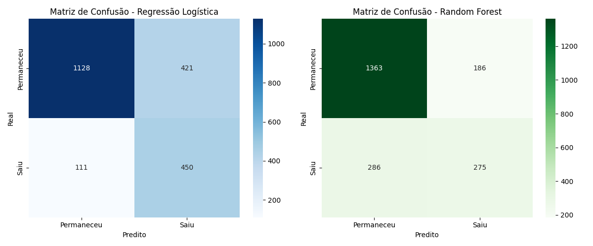
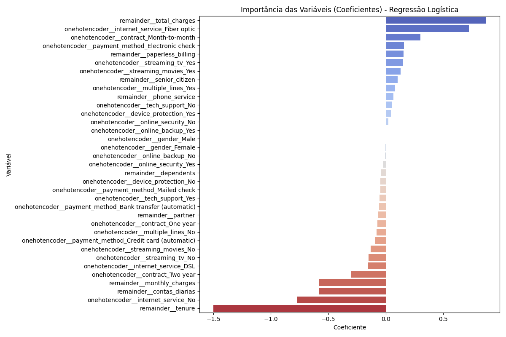

# 📊 Telecom X – Parte 2: Prevendo Churn de Clientes

## 🧠 Descrição do Desafio

Dando continuidade à primeira etapa de análise exploratória, agora assumimos o papel de **Analista de Machine Learning Júnior** na Telecom X. Nossa missão é construir modelos preditivos que antecipem quais clientes têm maior chance de **cancelar os serviços (churn)**, auxiliando a empresa na tomada de decisões estratégicas de retenção.

---

## 🎯 Objetivos

- Realizar pré-processamento dos dados (limpeza, encoding, normalização).
- Analisar a correlação entre variáveis.
- Balancear as classes utilizando **SMOTE**.
- Treinar e comparar dois modelos preditivos distintos.
- Avaliar desempenho e gerar insights estratégicos.

---

## 🛠️ Etapas do Projeto

### 🔧 1. Preparação dos Dados

- **Remoção de colunas irrelevantes:** Eliminado o identificador único e a coluna `contas_diarias` devido à multicolinearidade.
- **Encoding:** Aplicado `OneHotEncoder` com `ColumnTransformer` para variáveis categóricas.
- **Normalização:** Aplicada com `StandardScaler` nos dados de treino e teste, importante para modelos sensíveis à escala.
- **Balanceamento de Classes:** Utilizado **SMOTE** no conjunto de treino para lidar com o desbalanceamento entre classes (`churn` ≈ 26%), igualando a proporção das classes.
 
  

### 📊 2. Análise de Correlação

- A análise de correlação das variáveis numéricas (`tenure`, `senior_citizen`, `partner`, `dependents`, `phone_service`, `paperless_billing`, `monthly_charges`, `total_charges`) com a variável alvo `churn` revelou:
    - Correlação negativa moderada entre `tenure` e churn (-0.35), indicando que clientes com mais tempo de contrato tendem a evadir menos.
    - Correlação positiva fraca a moderada com `monthly_charges` (0.19), `paperless_billing` (0.19) e `senior_citizen` (0.15).
    - Identificação de multicolinearidade perfeita entre `monthly_charges` e `contas_diarias`, levando à remoção de `contas_diarias`.

      
  
### 📈 3. Análises Direcionadas

Visualizações (Boxplots e Scatterplots) foram realizadas para entender a relação entre variáveis numéricas importantes (`tenure`, `total_charges`, `monthly_charges`) e a evasão:

- **Boxplots:** Mostraram que clientes que evadiram (`churn`=1) tendem a ter menor tempo de contrato (`tenure`) e menor total gasto (`total_charges`) em comparação com clientes que permaneceram (`churn`=0).

- **Scatterplot:** Visualizou a relação entre `tenure` e `total_charges` colorida por `churn`, reforçando que clientes de longo prazo com alto gasto total são menos propensos a cancelar.

### ✂️ 4. Separação dos Dados

- Os dados foram divididos em conjuntos de treino e teste, com **70% para treino** e **30% para teste**, utilizando estratificação na variável `churn` para garantir que a proporção de clientes que cancelaram fosse mantida em ambos os conjuntos.

---

## 🤖 Modelos Treinados e Avaliação

Foram treinados três modelos de classificação nos dados de treino balanceados e padronizados, e avaliados no conjunto de teste original (padronizado para modelos sensíveis à escala):

| Modelo               | Normalização Necessária | Sensível à Escala | Tipo              |
|----------------------|-------------------------|--------------------|-------------------|
| Regressão Logística  | ✅ Sim                  | ✅ Sim             | Linear, baseline  |
| Random Forest        | ❌ Não                  | ❌ Não             | Baseado em árvore |
| KNN                  | ✅ Sim                  | ✅ Sim             | Baseado em distância |

### 📊 Desempenho dos Modelos no Conjunto de Teste

As métricas de avaliação (Precisão, Recall, F1-score e AUC) para a classe minoritária (Churn = 'Saiu') foram cruciais devido ao desbalanceamento de classes:

| Métrica         | Regressão Logística | Random Forest (Otimizado) | KNN            |
|-----------------|---------------------|---------------------------|----------------|
| Acurácia        | 75%                 | **78%**                   | 69%            |
| Precisão (Saiu) | 52%                 | **59%**                   | 45%            |
| Recall (Saiu)   | **80%**             | 55%                       | 72%            |
| F1-score (Saiu) | **0.63**            | 0.57                      | 0.55           |
| AUC             | **0.8443**          | 0.8385                    | 0.7545         |

### 🏆 Conclusão sobre o Melhor Modelo

Com base na avaliação, a **Regressão Logística** se destacou como o modelo com o melhor desempenho geral para este problema, apresentando o maior valor de **AUC (0.8443)** e o maior **Recall para a classe de churn (0.80)**. Isso indica que a Regressão Logística é mais eficaz em identificar a maioria dos clientes que realmente cancelarão, o que é fundamental para ações de retenção proativas.

Embora o Random Forest otimizado tenha apresentado uma acurácia e precisão ligeiramente maiores, seu recall para a classe de churn foi significativamente menor (55% vs 80% da Regressão Logística). O KNN teve o desempenho mais baixo entre os três modelos avaliados.

Portanto, a **Regressão Logística** é considerada o modelo mais promissor para ser utilizado na identificação de clientes em risco de evasão, permitindo que a empresa concentre seus esforços de retenção de forma mais eficaz.

---

## 📌 Principais Fatores de Churn (Análise de Importância das Variáveis)

A análise dos coeficientes da Regressão Logística e da importância das variáveis do Random Forest revelou os seguintes fatores consistentemente importantes na previsão de churn:

-   **Tempo de Contrato (Tenure):** Clientes com menor tempo de casa são mais propensos a sair.
-   **Tipo de Contrato:** Contratos mensais ('Month-to-month') estão fortemente associados a maior churn, enquanto contratos de dois anos ('Two year') estão associados a menor churn.
-   **Serviço de Internet:** Clientes com serviço de fibra óptica ('Fiber optic') apresentam maior risco de evasão.
-   **Método de Pagamento:** Utilizar cheque eletrônico ('Electronic check') está associado a maior probabilidade de churn.
-   **Encargos Totais (Total Charges):** Menor gasto total indica maior propensão a cancelar, relacionado ao menor tempo de contrato.
-   **Encargos Mensais (Monthly Charges):** Valores mais altos nos encargos mensais também contribuem para o risco de churn.

---

## 🚀 Estratégias de Retenção Propostas

Com base nos fatores de risco identificados e no modelo de Regressão Logística, as seguintes estratégias de retenção são recomendadas:

1.  **Programas de Engajamento nos Primeiros Meses:** Focar em clientes nos primeiros meses de contrato e aqueles com contrato mensal, oferecendo suporte proativo e incentivos para fortalecer o relacionamento.
2.  **Análise da Experiência com Fibra Óptica:** Investigar e melhorar a satisfação dos clientes de fibra óptica, abordando possíveis problemas de serviço ou custo.
3.  **Segmentação por Método de Pagamento:** Analisar o comportamento dos clientes que pagam via cheque eletrônico para identificar insatisfações e oferecer alternativas ou suporte.
4.  **Ofertas de Longo Prazo:** Incentivar a migração de contratos mensais para contratos de maior duração (um ou dois anos) através de descontos ou benefícios exclusivos.
5.  **Comunicação Personalizada:** Utilizar os insights do modelo para segmentar clientes em risco e enviar comunicações personalizadas com ofertas relevantes.

---

## 👨‍💻 Autor

**Mateus Sanfer**
Técnico em Desenvolvimento de Sistemas | Analista de Machine Learning Júnior | 
| [ Mateus Sanfer](https://github.com/MateusSanfer) |
| :---: |

---

## 📝 Licença

Este projeto foi desenvolvido apenas para fins educacionais com dados fictícios.  
Distribuído livremente sob a [MIT License](LICENSE).
